# myDevOps-Docker-Compose
## Part 2 Multi-Container Application Deployment using Docker Compose

●	Create a Docker file for the web application container which should include the necessary dependencies to run the web application. The web application should display a simple "Hello, World!" message when accessed from a web browser. (5 marks)
A simple flask app which will route page to return "Hello DevOps World!"

●	Create a Docker file for the database container which should include the necessary dependencies to run the database. You can use any database of your choice (e.g.,MySQL, PostgreSQL, MongoDB, etc.). (5 marks)
Created the file in /db/dockerfile 
(content of this file are as follows)

FROM mysql:latest

EXPOSE 3306

●	Create a docker-compose.yml file that defines the two services - web and database. The web service should be linked to the database service using Docker Compose networking. (5 marks)
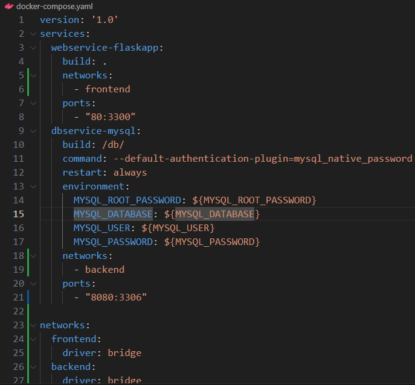
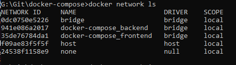

●	Use the docker-compose up command to build and run the application. Verify that the web application is accessible from a web browser and that the database is running. (5 marks)
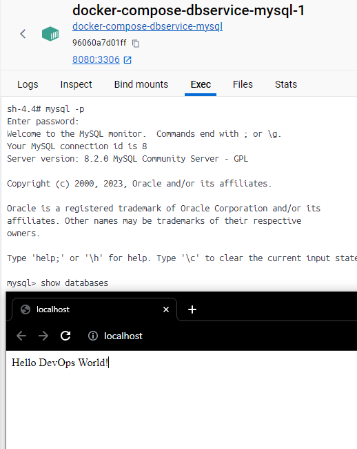

●	Modify the Docker file for the web application container to include a new feature (e.g., a new message, a new page, etc.). Rebuild the web application container and redeploy the application using docker-compose. Verify that the new feature is working as expected. (10 marks)
Adding new route to frontend app, re-building followed by 'docker-compose up' command.
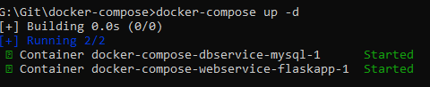
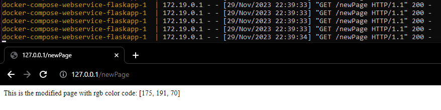

●	Implement a backup strategy for the database. This can be achieved using a Docker volume or by running a backup script periodically. (10 marks)
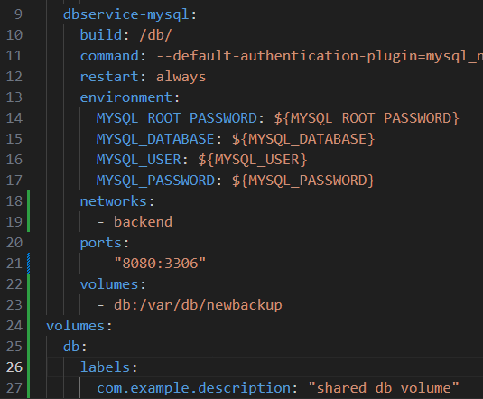
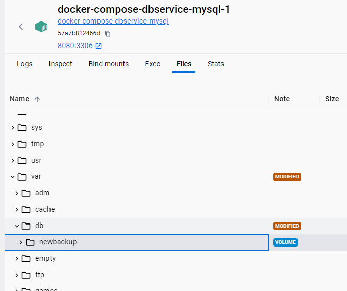

●	Implement a scaling strategy for the web application. This can be achieved by using the docker-compose scale command to create multiple instances of the web service. Verify that the web application is accessible and working correctly when scaled. (10 marks)
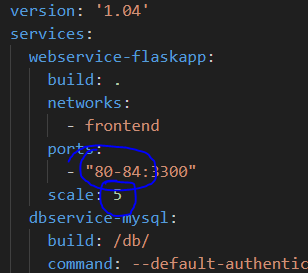
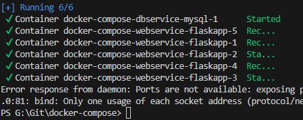
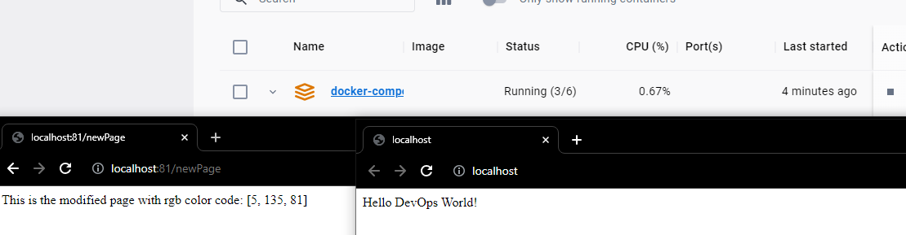

●	Implement a monitoring strategy for the application. This can be achieved by using a tool like Prometheus or Grafana to monitor the health and performance of the containers. (10 marks)
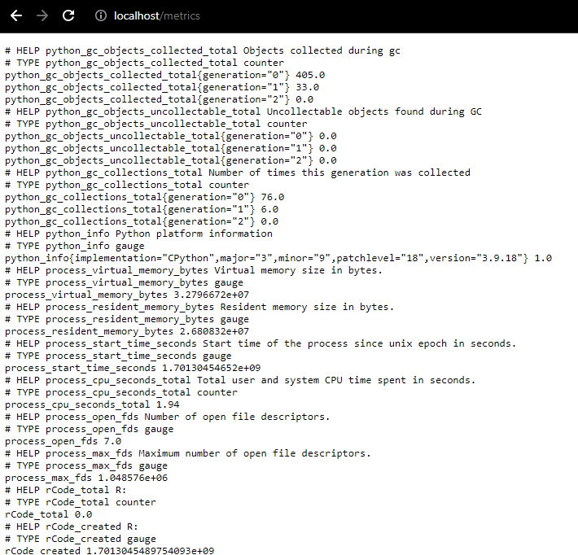
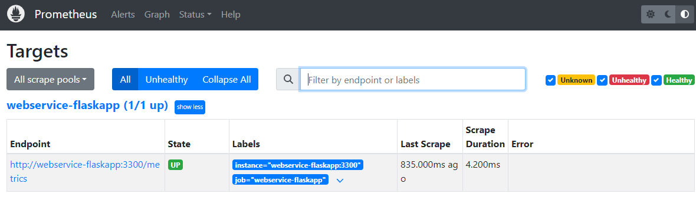
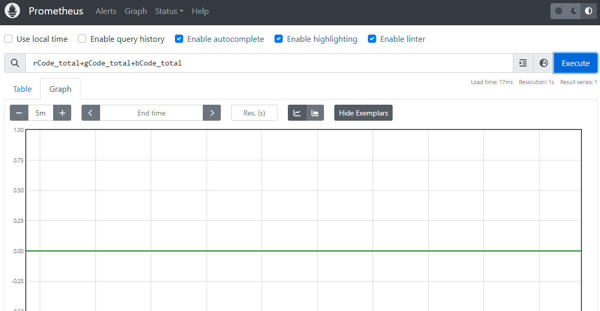

●	Create a README.md file and document your findings for each command. For each command, provide a brief description of what it does, followed by the output and logs generated by the command. Ensure that the README.md file is well-organized, easy to read, and contains all necessary information. (20 marks)
-- This is the required 'README.md' file.

●	Push the codebase for the sample application to your GitHub repository (create a new one for this part)
https://github.com/Smurfie07/myDevOps-Docker-Compose.git